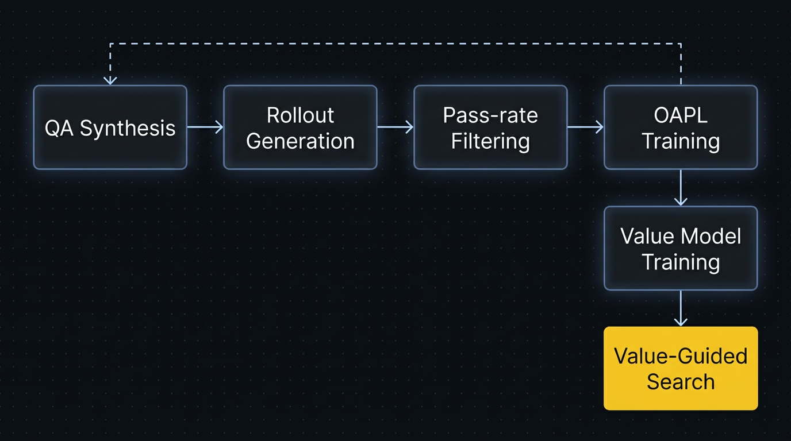

<div align="center">


# KONASH

**Knowledge-grounded Off-policy Networks for Agentic System Harnesses**

<p>
Point it at any document corpus — it trains a model that learns <i>how to search</i>, not just facts.
</p>

[](https://pypi.org/project/konash/)
[](CONTRIBUTING.md)
[](LICENSE)

</div>

KONASH trains knowledge agents via reinforcement learning that match or exceed frontier models on grounded reasoning tasks — at a fraction of the cost.

---

## Key Benefits

- 💰 **100x cheaper training** — Small training clusters. ~$100 per iteration instead of ~$100K–500K.
- 🎯 **Higher quality** — RL-trained agents search more efficiently, retrieve more diversely, and reason more accurately than frontier models. The gains are algorithmic, not scale-dependent.
- 🔁 **Consistent results** — Parallel thinking (N=10–20 rollouts + aggregation) turns probabilistic search into near-deterministic accuracy. Cheap rollouts on a small model mean you can afford this on every query.
- 🔓 **Zero lock-in** — Your model, your weights, your infrastructure. Deploy anywhere with vLLM and LoRA hot-swapping.

## 🚀 Quickstart

```bash
pip install konash
konash setup    # walks you through API keys
konash train    # pick a corpus, model, and scale — hit go
```

Setup takes 2 minutes. Training scales from ~1 hour (Quick) to several hours (Exhaustive).

### What happens under the hood

1. **Corpus ingestion** — Embeds and indexes your documents for vector search (pre-built indexes ship with supported datasets)
2. **QA synthesis** — An agentic loop explores the corpus via search and generates grounded, multi-constraint question-answer pairs
3. **Rollout generation** — The model attempts to answer each question via multi-step search, generating full agent trajectories
4. **Pass-rate filtering** — Keeps questions at the learning frontier (not too easy, not too hard)
5. **OAPL training** — Off-policy RL with squared advantage loss trains the model on successful search strategies
6. **Value-Guided Search** — A learned value model scores partial rollouts to guide test-time tree search

### Evaluate your agent

```bash
konash eval financebench --limit 1
```

Or in Python:

```python
import konash

agent = konash.Agent(
    base_model="zai-org/GLM-4.5-Air-FP8",
    corpus="./my_documents",
)
agent.train(iterations=1)
answer = agent.solve("Your question here", parallel_rollouts=3)
```

---

## Features

| Feature | Description |
|---|---|
| **Agentic QA Synthesis** | Multi-turn agent loop explores your corpus via search, generates grounded multi-constraint question-answer pairs |
| **OAPL Training** | Off-policy RL with squared advantage loss trains on successful search trajectories |
| **Value-Guided Search** | Learned value model scores partial rollouts, parallel BFS tree search at inference time |
| **Pass-Rate Filtering** | Keeps questions at the learning frontier — not too easy, not too hard (0.1–0.9 pass rate) |
| **Parallel Rollouts** | N=10–20 independent rollouts + aggregation for consistent answers |
| **Pre-built Indexes** | Ships with Qwen3-Embedding-8B indexes for supported datasets — no embedding step needed |
| **Any Corpus** | Point at a local folder of documents — KONASH builds the index on first run |

---

## 🔍 How It Works

Standard retrieval systems use a frozen model with a single retrieve-then-read pass. KONASH trains the model's **search policy** through reinforcement learning:

- The model learns **what to search for** (query generation)
- The model learns **when to search again** (multi-step retrieval)
- The model learns **how to reason** over retrieved evidence (cross-document synthesis)
- The trained model **generalizes to new corpora** it hasn't seen

<p align="center">
  
</p>

Each iteration: synthesize → rollout → filter → train → repeat with improved model.

---

## Evaluation

### FinanceBench (150 questions, SEC filings)

GLM 4.5 Air on FinanceBench — no training, base model only:

| Mode | Accuracy | Avg Score | Avg Latency |
|------|----------|-----------|-------------|
| Single rollout | **69%** (103/150) | 0.720 | 35.0s |

Scored with LLM-based nugget evaluation (gpt-4o-mini judge, KARL paper Appendix D.1). Each question runs a multi-step search agent over 53K embedded SEC filing pages with Qwen3 embeddings + FAISS vector search.

The KARL paper reports **76%** on FinanceBench after RL training (2 iterations, 12K synthesized QA pairs). KONASH implements this training pipeline — the gap between 69% (base) and 76% (trained) is what OAPL training closes.

### QAMPARI (Wikipedia entity search)

| Mode | Accuracy | Avg Score | Avg Latency |
|------|----------|-----------|-------------|
| Single rollout | **60%** (3/5) | 0.614 | 44.5s |

Exhaustive entity retrieval over 293K Wikipedia sentence-level chunks. Each question requires finding ALL entities satisfying a condition.

<details>
<summary>Reproduce these results</summary>

```bash
pip install konash
konash setup
konash eval financebench
konash eval qampari
konash eval financebench --parallel 5   # add parallel thinking
konash eval financebench --train        # train + eval
```

Results are saved to `eval_results/` and viewable in the eval trace viewer at `http://localhost:5050/eval/` (run `python tools/server.py`).
</details>

---

## Requirements

### API Keys (set up via `konash setup`)

| Service | Purpose | Cost |
|---------|---------|------|
| **Shadeform** | Required for `konash train` GPU provisioning (synthesis, rollouts, OAPL) | GPU hourly billing |
| **Together AI** | Optional eval and serving backend | Pay-as-you-go |
| **HuggingFace** | Pre-built embedding indexes, query embeddings via Inference API | Free |
| **OpenAI** *(optional)* | Judge model for eval scoring (gpt-4o-mini) | ~$0.01 per eval question |

### Python

- Python >= 3.11
- Core dependencies: `numpy`, `rich`, `together`, `huggingface_hub`
- Optional: `faiss-cpu` (fast vector search), `torch` + `transformers` + `peft` (local training)

---

## Cloud Training & Eval

KONASH uses cloud GPUs for the full remote training pipeline. In the current `konash train` path, synthesis, rollouts, and OAPL all run on the provisioned box, and the resulting checkpoints are synced back into `~/.konash/projects/...`.

We recommend **[Shadeform](https://shadeform.ai)** for GPU provisioning — it aggregates 20+ cloud providers and finds the cheapest available GPU automatically.

```bash
pip install konash
konash setup
konash train browsecomp-plus --model zai-org/GLM-4.5-Air-FP8 --gpu-type H200
```

For `zai-org/GLM-4.5-Air-FP8`, the cleanest current path is `1x H200`. On non-H200 hardware, GLM may require `2x H100` for the sleep/wake vLLM path.

What `konash train` does today:

1. Provisions a Shadeform GPU
2. Uploads the current local checkout
3. Downloads the selected corpus on the remote box
4. Runs synthesis, dedup, rollouts, filtering, and OAPL remotely
5. Streams progress into `http://localhost:5050/training/`
6. Downloads checkpoints and tears the GPU down unless `--keep-alive` is set

| GPU | Typical use | Notes |
|-----|-------------|-------|
| H200 | Recommended for GLM 4.5 Air training | Best current bring-up path |
| H100 SXM | Works for remote training | GLM sleep/wake requires 2+ GPUs |

For running evals on remote GPUs (e.g., with vLLM), see the [Shadeform eval guide](scripts/shadeform_eval_guide.md).

---

## Supported Datasets

Datasets download automatically when selected in `konash train` or `konash eval`:

| Dataset | Domain | Chunks | Pre-built Index | Eval Questions |
|---------|--------|--------|-----------------|----------------|
| **FinanceBench** | SEC filings, financial reports | 53,803 | Qwen3-Embedding-0.6B | 150 |
| **QAMPARI** | Wikipedia entity search | 292,825 | Qwen3-Embedding-0.6B | 1,000 |
| **BrowseComp-Plus** | Web documents | 100,195 | Qwen3-Embedding-8B (Tevatron) | 830 |
| **FreshStack** | Technical docs (LangChain) | 48,068 | Qwen3-Embedding-0.6B | 203 |
| **Local folder** | Your own documents | Any | Built on first run | — |

### Supported file formats (local folders)

`.txt` `.md` `.rst` `.csv` `.log` `.json` `.html` `.htm` `.py` `.js` `.ts` `.java` `.go` `.rs` `.c` `.cpp` `.h`

---

## Supported Models

Training and eval are not symmetric. `konash eval` can use a broader set of hosted models, but `konash train` depends on models that work cleanly in the remote Unsloth + vLLM pipeline.

Training-tested / recommended:

| Model | Type | Notes |
|-------|------|-------|
| **GLM 4.5 Air** | Frontier MoE | Default training target, best current KARL-style path |
| **MiniMax M2.5** | MoE | Strong frontier MoE available on Together AI |

For eval and serving, you can use a broader set of models exposed through Together AI or compatible hosted APIs.

Compare models head-to-head in the [Arena](http://localhost:5050/arena/) (run `python tools/server.py`).

---

## Contributing

Contributions are welcome! Please open an issue or PR on [GitHub](https://github.com/konaequity/konash/issues).

---

## Citation

```bibtex
@misc{konaequity2026konash,
  author = {Kona Equity},
  title = {KONASH: Knowledge-grounded Off-policy Networks for Agentic System Harnesses},
  year = {2026},
  publisher = {GitHub},
  journal = {GitHub repository},
  howpublished = {\url{https://github.com/konaequity/konash}}
}
```

---

## 🙏 Credits

KONASH builds directly on:

- [KARL: Knowledge Agents via Reinforcement Learning](https://www.databricks.com/sites/default/files/2026-03/karl.pdf) — Databricks, 2026. The architecture, training pipeline, and evaluation methodology that KONASH implements.
- [OAPL](https://arxiv.org/abs/2602.19362) — Ritter et al., 2026 (the RL algorithm)
- [Tevatron](https://huggingface.co/Tevatron) — Pre-built BrowseComp-Plus embedding indexes
- [Unsloth](https://github.com/unslothai/unsloth) — Parameter-efficient training
- [FAISS](https://github.com/facebookresearch/faiss) — Vector search

## License

[Apache 2.0](LICENSE)
